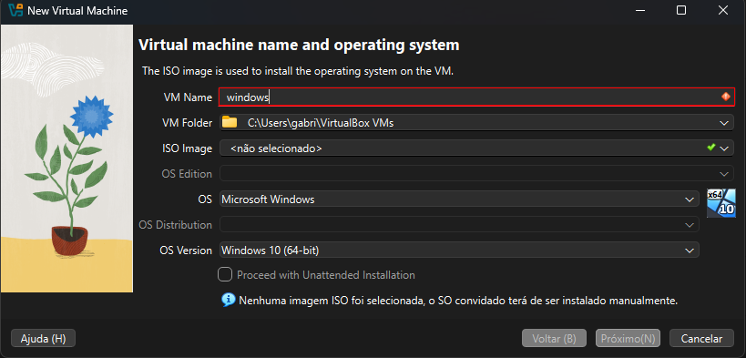
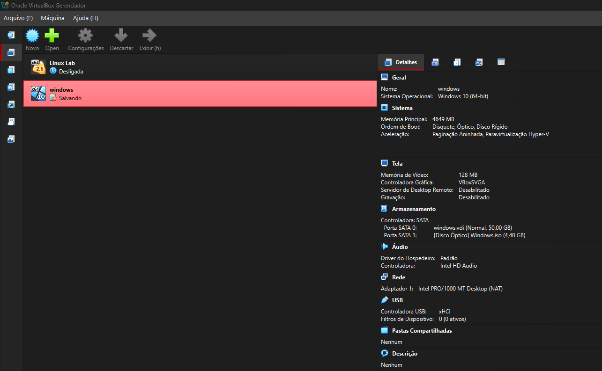
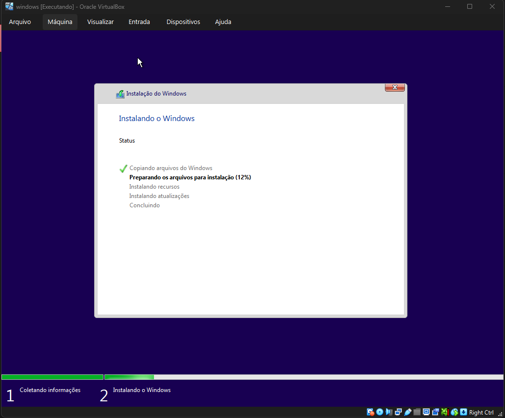
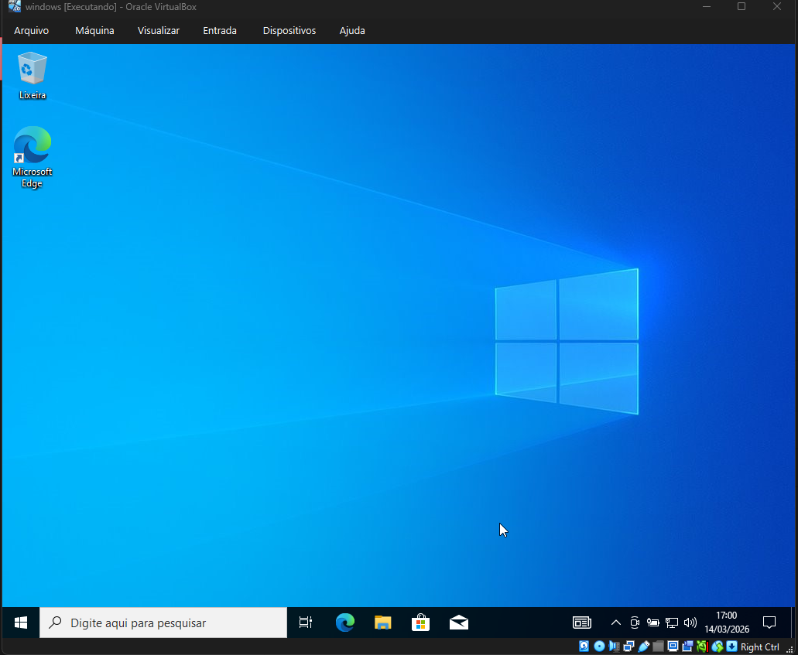
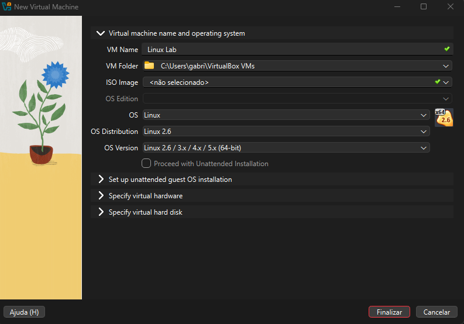
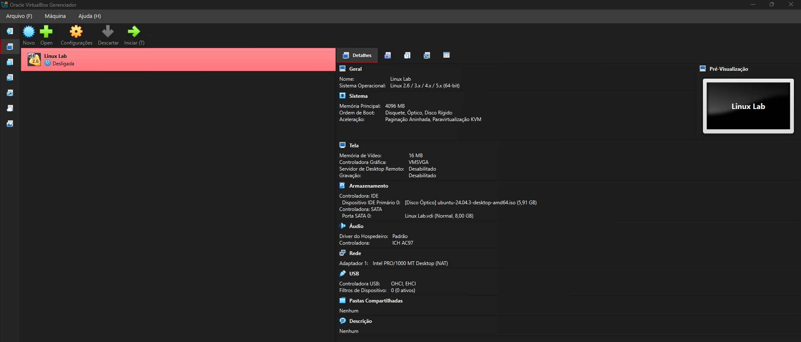
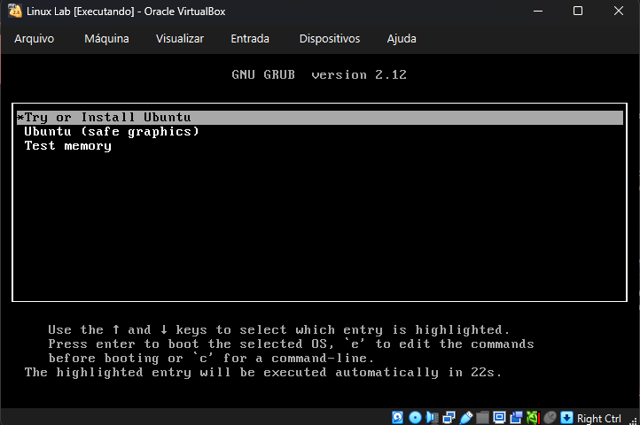
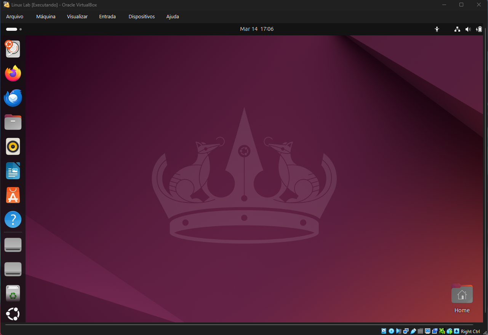

# 🖥️ Virtualization Lab

Projeto introdutório de virtualização focado na criação e configuração de máquinas virtuais Windows e Linux utilizando Oracle VirtualBox para preparação de ambientes de laboratório.

---

## 🎯 Objetivo

Praticar conceitos básicos de virtualização através da criação e configuração de máquinas virtuais, compreendendo o processo de provisionamento de recursos e instalação de sistemas operacionais em ambiente virtualizado.

---

## 🛠️ Tecnologias Utilizadas

- Oracle VirtualBox  
- Windows  
- Linux  

---

## ⚙️ Atividades Realizadas

Durante o laboratório foram executadas as seguintes atividades:

- Criação de máquinas virtuais no VirtualBox  
- Configuração de memória RAM e armazenamento virtual  
- Instalação de sistemas operacionais Windows e Linux  
- Inicialização e validação dos ambientes virtualizados  

---

## 📸 Evidências do Projeto

### Máquina Virtual Windows

#### Criação da VM

#### Configuração Geral

#### Instalação

#### Sistema em Execução

---

### Máquina Virtual Linux

#### Criação da VM

#### Configuração Geral

#### Instalação

#### Sistema em Execução

---

## 📚 Conhecimentos Aplicados

- Fundamentos de Virtualização  
- Provisionamento de Máquinas Virtuais  
- Instalação de Sistemas Operacionais  
- Configuração de Recursos Virtuais  

---

## 🚀 Resultado

Ao final do laboratório foi possível criar e configurar ambientes virtualizados funcionais para Windows e Linux, estabelecendo base prática para desenvolvimento de futuros laboratórios técnicos em infraestrutura e suporte.
